# Flutter and Dart Lab Experiments 🚀

A collection of 12 practical experiments covering Dart programming and Flutter application development. This repository includes hands-on exercises on programming fundamentals, UI design, responsive layouts, navigation, state management, API integration, local storage, animations, and a mini project.

## 📚 Experiments

| No. | Experiment | File Name | Concepts Covered |
|:---:|---|---|---|
| 01 | Dart Language Basics | `experiment_01_dart_basics.dart` | Variables, data types, operators, functions, and control flow |
| 02 | Flutter Widgets and Layouts | `experiment_02_widgets_layouts.dart` | Text, Image, Container, Row, Column, and Stack |
| 03 | Responsive UI Design | `experiment_03_responsive_ui.dart` | MediaQuery, breakpoints, and adaptive layouts |
| 04 | Navigation and Named Routes | `experiment_04_navigation.dart` | Navigator, screen transitions, and named routes |
| 05 | State Management | `experiment_05_state_management.dart` | StatefulWidget, StatelessWidget, setState, and Provider |
| 06 | Custom Widgets and Styling | `experiment_06_custom_widgets.dart` | Reusable widgets, themes, colors, and decorations |
| 07 | Forms and Validation | `experiment_07_forms.dart` | TextFormField, controllers, and input validation |
| 08 | Lists and Grid Views | `experiment_08_lists_grids.dart` | ListView.builder, GridView.builder, and dynamic lists |
| 09 | REST API Integration | `experiment_09_api_integration.dart` | HTTP requests, JSON parsing, async/await, and FutureBuilder |
| 10 | Local Data Storage | `experiment_10_local_storage.dart` | SharedPreferences and local storage |
| 11 | Flutter Animations | `experiment_11_animations.dart` | AnimatedContainer, AnimationController, Tween, and AnimatedBuilder |
| 12 | Flutter Mini Project | `experiment_12_mini_project.dart` | Student Task Manager, user input, lists, and state management |

## 📸 Experiment Screenshots

Screenshots for all experiments are stored in the `screenshots/` directory.

### Experiment 1: Dart Language Basics
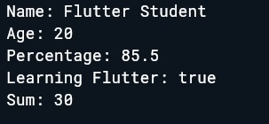

### Experiment 2: Flutter Widgets and Layouts
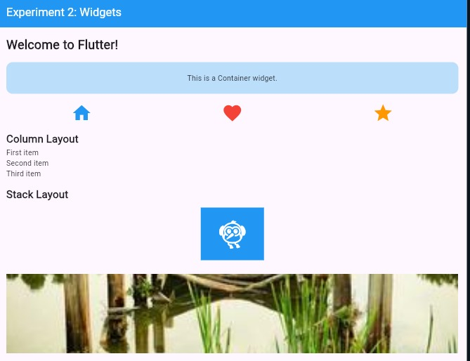

### Experiment 3: Responsive UI Design
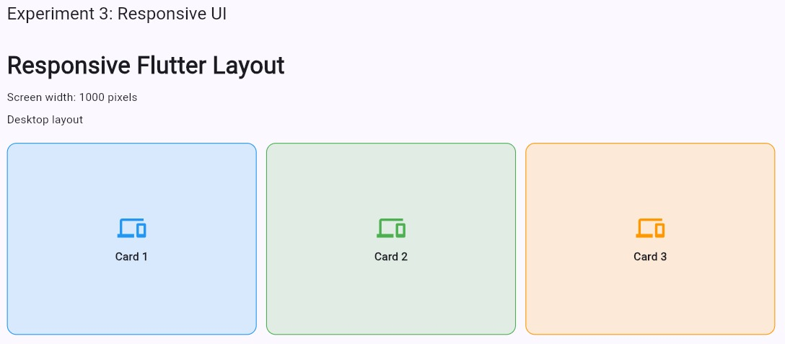

### Experiment 4: Navigation and Named Routes
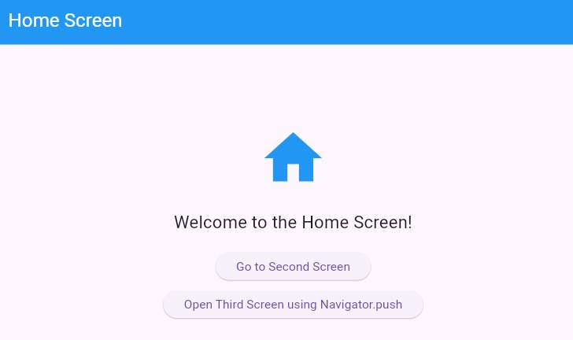

### Experiment 5: State Management
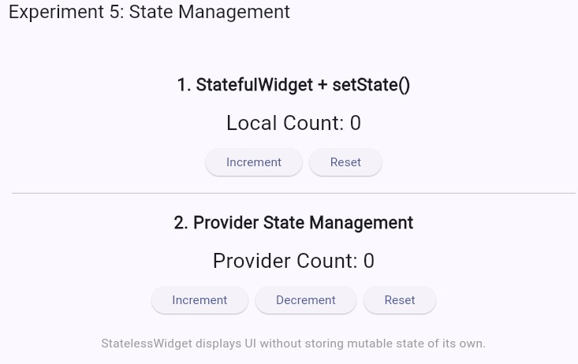

### Experiment 6: Custom Widgets and Styling
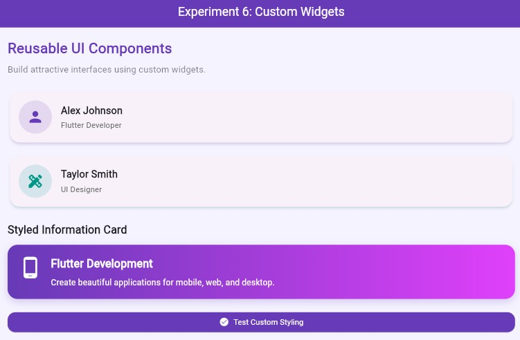

### Experiment 7: Forms and Validation
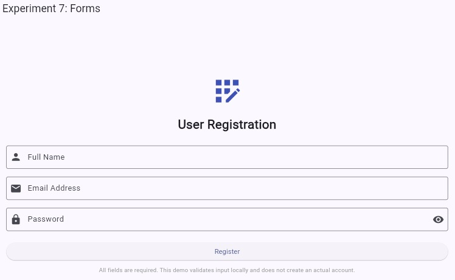

### Experiment 8: Lists and Grid Views
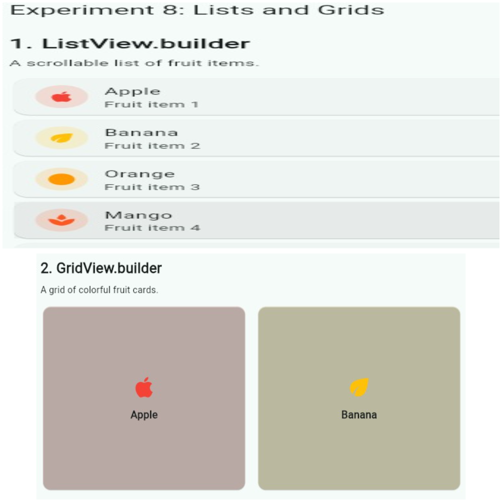

### Experiment 9: REST API Integration
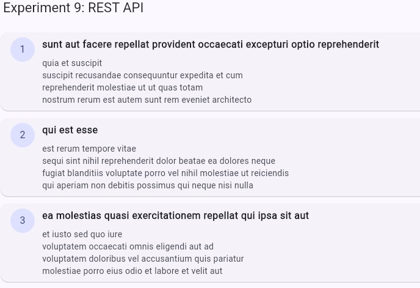

### Experiment 10: Local Data Storage
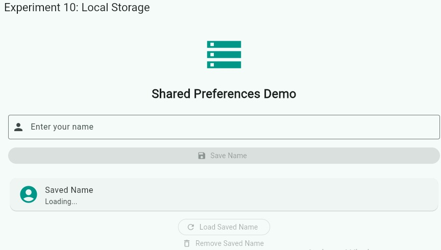

### Experiment 11: Flutter Animations
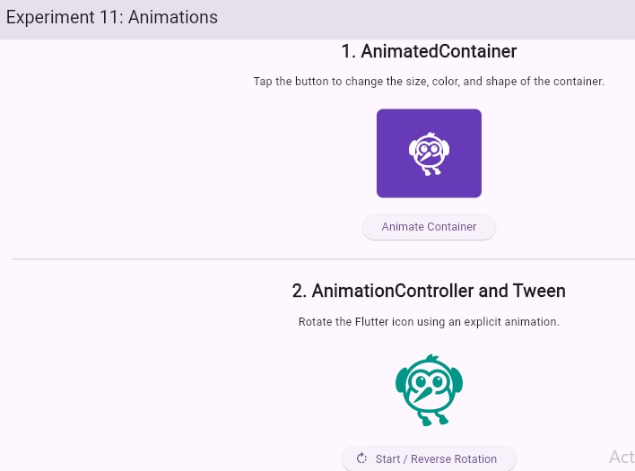

### Experiment 12: Flutter Mini Project
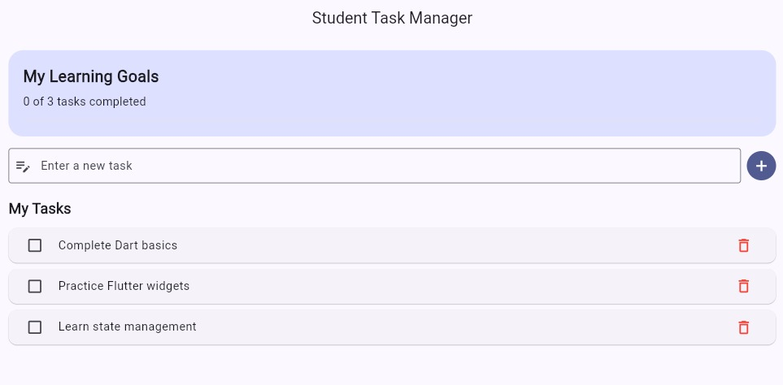

> **Note:** Ensure all screenshot filenames match the actual files in your repository.

## 🎯 Learning Objectives

- Understand Dart syntax and programming fundamentals.
- Build user interfaces using Flutter widgets.
- Create responsive layouts for different screen sizes.
- Implement navigation using Navigator and named routes.
- Manage application state using `setState` and Provider.
- Create reusable widgets and apply custom styling.
- Build forms with input validation.
- Display data using lists and grid layouts.
- Fetch and process data from REST APIs.
- Store application data locally.
- Implement animations in Flutter.
- Develop a mini project using Flutter concepts.

## 🛠️ Technologies Used

- **Dart** — Programming language.
- **Flutter** — Cross-platform UI framework.
- **Provider** — State management.
- **HTTP** — REST API communication.
- **Shared Preferences** — Local key-value storage.
- **Git and GitHub** — Version control and source-code hosting.
- **Visual Studio Code / Android Studio** — Development environments.

## 📋 Prerequisites

Install the following tools before running the experiments:

- Flutter SDK
- Dart SDK (included with Flutter)
- Visual Studio Code or Android Studio
- Git
- An Android emulator or supported device, if needed

Verify your Flutter installation:

```bash
flutter doctor
```

## 🚀 Getting Started

### 1. Clone the Repository

Replace `YOUR_USERNAME` with your GitHub username.

```bash
git clone https://github.com/YOUR_USERNAME/flutter-dart-lab-experiments.git
cd flutter-dart-lab-experiments
```

### 2. Set Up a Flutter Project

If the repository contains individual Dart files rather than a complete Flutter project, create a new Flutter project:

```bash
flutter create flutter_lab
cd flutter_lab
```

Copy the selected experiment file into the project's `lib/` directory.

If the repository already contains a valid Flutter project with `pubspec.yaml` and a `lib/` directory, skip this step.

### 3. Configure Dependencies

Add the packages required by your experiment to `pubspec.yaml`.

Example:

```yaml
dependencies:
  flutter:
    sdk: flutter
  http: ^1.5.0
  shared_preferences: ^2.5.3
  provider: ^6.1.5
```

Only include packages required by your selected experiment. Check [pub.dev](https://pub.dev/) for compatible versions.

### 4. Install Dependencies

Run this command from the directory containing `pubspec.yaml`:

```bash
flutter pub get
```

### 5. Run an Experiment

Place the selected experiment's code in `lib/main.dart`, ensuring it contains the necessary imports and a valid `main()` function.

Run the application:

```bash
flutter run
```

**Note:** Each experiment with its own `main()` function is intended to run separately unless adapted for a shared application. Experiment 1 can be run independently as a Dart program:

```bash
dart experiment_01_dart_basics.dart
```

## 📁 Repository Structure

```text
flutter-dart-lab-experiments/
├── screenshots/
│   ├── experiment_01_dart_basics.png
│   ├── experiment_02_flutter_widgets.png
│   ├── experiment_03_responsive_ui.png
│   ├── experiment_04_navigation.png
│   ├── experiment_05_state_management.png
│   ├── experiment_06_custom_widgets.png
│   ├── experiment_07_forms.png
│   ├── experiment_08_lists_grids.png
│   ├── experiment_09_api_integration.png
│   ├── experiment_10_local_storage.png
│   ├── experiment_11_animations.png
│   └── experiment_12_mini_project.png
├── experiment_01_dart_basics.dart
├── experiment_02_widgets_layouts.dart
├── experiment_03_responsive_ui.dart
├── experiment_04_navigation.dart
├── experiment_05_state_management.dart
├── experiment_06_custom_widgets.dart
├── experiment_07_forms.dart
├── experiment_08_lists_grids.dart
├── experiment_09_api_integration.dart
├── experiment_10_local_storage.dart
├── experiment_11_animations.dart
├── experiment_12_mini_project.dart
├── pubspec.yaml
└── README.md
```

## 📈 Learning Outcomes

By completing these experiments, learners gain practical experience in:

- Dart programming fundamentals.
- Flutter UI development and responsive design.
- Reusable widgets and custom layouts.
- Navigation and state management.
- Form handling and validation.
- REST API integration and asynchronous programming.
- Local data persistence.
- Animation techniques.
- Building a mini application using Flutter.

## 👨‍💻 Author

**Flutter and Dart Lab Experiments**

An educational repository created to practise Flutter and Dart through hands-on laboratory experiments.

## 📄 License

This repository is intended for educational purposes. Add a `LICENSE` file to specify how others may use, modify, or distribute the code.
